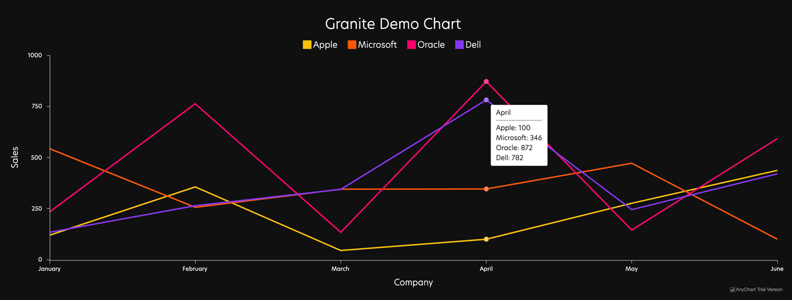

## Aligning your data
Data can be aligned three different ways to accomidate our single series, multiple series and drilldown chart types.

# Single Series Data
#### Settings Level
Multiple Series
```html
False
```
#### Record Level
Label (String)
```html
Apple
```
Value (Single Number)
```html
35
```
Series Name (String)
```html
Sales in Q3
```
#### Output

```js
"records": [
    {"x": "Apple", "value": "234"},
    {"x": "Microsoft", "value": "491"},
    {"x": "Oracle", "value": "395"}
  ];
```

# Multi Series Data
#### Settings Level
Multiple Series
```html
True
```
X Axis Labels (Array of values)
``` js
["January", "February", "March", "April", "May", "June", "July"]
```
#### Record Level
Label (String)
```html
Apple
```
Series Data (array)
```js
[120, 356, 45, 100, 276, 437, 134]
```
#### Output

```js
"options":{
    "x_axis_labels": ["January", "February", "March", "April", "May", "June"]
    },
"records":[
    {"x": "Apple", "series_values": [120, 356, 45, 100, 276, 437]},
    {"x": "Microsoft", "series_values": [543, 256, 345, 346, 472, 100]},
    {"x": "Oracle", "series_values": [234, 763, 134, 872, 145, 592]},
    {"x": "Dell", "series_values": [434, 863, 20, 782, 243, 46]}
    ]
```

# Drilldown
#### Settings Level
```html
False
```
Drilldown Chart Type One (Picklist)
```html
Pie
```
Drilldown Chart Type Two (Picklist)
```html
Line
```
Drilldown Chart Two Title (Picklist)
```html
Title Here
```
Multiple Series: False
#### Record Level
Label (String)
```html
Apple
```
Value (Single Number)
```html
234
```
Series Name (String)
```html
Sales in Q3
```
Drilldown Data (Array of Objects)
``` js
[
{"x":"Q1","value":792026},
{"x":"Q2","value":610501},
{"x":"Q3","value":441843},
{"x":"Q4","value":350711}
]
```
#### Output

```js
"records": [
    {"x": "Apple", "value": "234", "drilldown": [
      {"x": "Q1", "value": 792026},
      {"x": "Q2", "value": 610501},
      {"x": "Q3", "value": 441843},
      {"x": "Q4", "value": 350711}
  ]},
    {"x": "Microsoft", "value": "491", "drilldown": [
      {"x": "Q1", "value": 1378786},
      {"x": "Q2", "value": 571063},
      {"x": "Q3", "value": 510493},
      {"x": "Q4", "value": 797105}
  ]},
    {"x": "Oracle", "value": "395", "drilldown": [
      {"x": "Q1", "value": 499299},
      {"x": "Q2", "value": 649963},
      {"x": "Q3", "value": 571176},
      {"x": "Q4", "value": 242969}
    ]}
  ];
```

